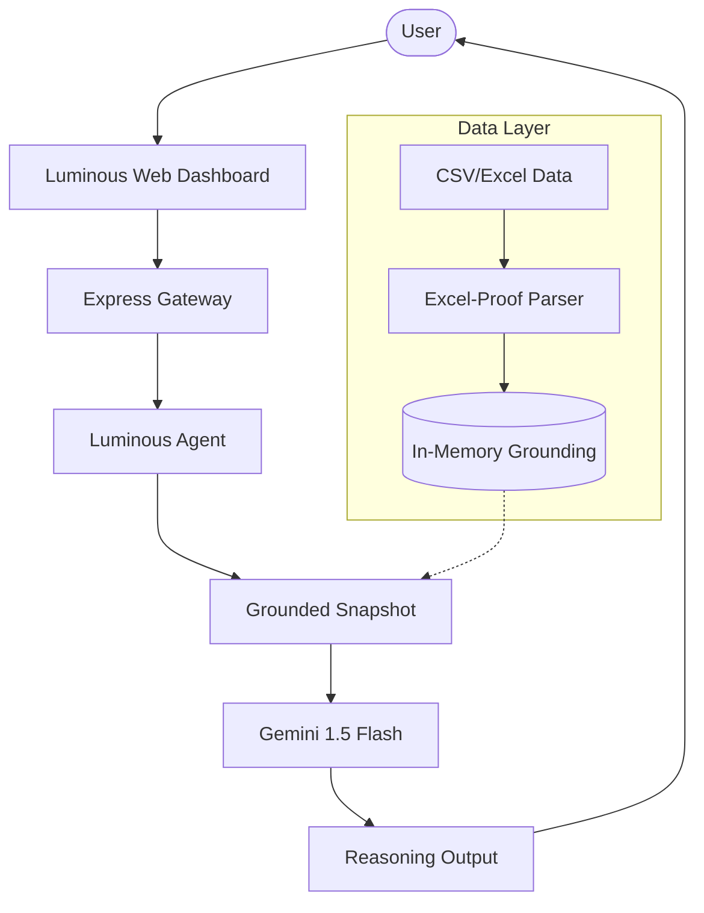

# CashGuardian: Luminous Edition™ 💎

**Talk to your business finances in plain English — via natural language, grounded in your operational reality.**

[](https://cash-guardian-three.vercel.app/)
[](https://aistudio.google.com/)

---

## 🌟 The Luminous Edge
CashGuardian: Luminous Edition is a premium, agentic "Talk to Data" platform designed for Indian SMEs. It bridges the gap between raw operational data and executive decision-making using high-fidelity grounding and agentic reasoning.

### Key Innovations:
- **🧠 Agentic Reasoning Engine**: Powered by state-orchestration that classifies intent, grounds data, and reasons through complex financial pivots (Variance, Comparsion, Risk).
- **📊 Excel-Proof Ingestion**: Robust, localized data processing that handles Indian currency symbols (₹), commas, and varying date formats automatically.
- **🛡️ Executive Dossiers**: Professional, high-fidelity PDF generation with visual analytics supplements for immediate board-room sharing.
- **⚔️ Performance Duels**: High-intensity head-to-head entity comparison to identify exact growth drivers between clients, categories, or periods.

---

## 🚀 One-Minute Showcase

### 1. Unified Dashboard

*Real-time executive metrics panel including net balance, overdue counts, and a 13-week cash trajectory.*

### 2. High-Fidelity "Talk to Data"
**User**: *"Why did my revenue drop this month?"*  
**AI**: #### Executive Analysis: Revenue Variance
> Revenue decreased by **12% (₹1,45,000)** MoM. The primary driver was a **logistics spike** (+45%) and a slowdown in **Bulk Order** volume from Sharma Retail. 
**Strategic Next Step**: Send a payment reminder to Krishan Distributors to offset the liquidity gap.

---

## 🏗️ Architecture: Grounding-First
CashGuardian uses a **Strict Grounding** architecture. No transaction reaches the AI until it has been processed by our deterministic services layer.



---

## 🛠️ Tech Stack
| Tier | Technology | Rationale |
|---|---|---|
| **Intelligence** | Gemini 1.5 Flash | SOTA performance with 1.5M token context for deep financial history. |
| **Logic** | Node.js / LangGraph-Inspired | Fast, stateful execution of complex analytical pivots. |
| **Parsing** | Luminous Robust Parser | Handles localized Indian SME data formatting (₹, commas, dates). |
| **UI** | Luminous CSS / Vanilla JS | Ultra-fast, premium glassmorphism interface with zero dependency bloat. |
| **Reports** | jsPDF / Chart.js | Professional PDF generation with visual data appendix. |

---

## ⚙️ Quick Start

### 1. Install
```bash
npm install
copy .env.example .env
```

### 2. Configure
Add your `AI_API_KEY` to `.env`. CashGuardian is optimized for the **Gemini 1.5 Flash** free tier.

### 3. Launch
```bash
npm run web
```
Visit `localhost:3001` and upload your CSV to start the intelligence session.

---

## 🧪 Benchmark & Quality
Verified against 13 high-intensity financial use cases:
- ✅ **Accuracy**: 13/13 verified against ground-truth.
- ✅ **Latency**: <5ms base service latency.
- ✅ **Tests**: 67 Jest tests passing.

---

## 🔒 Privacy & Sovereignty
- **Data Sovereignty**: All processing is local-first. Uploaded data remains in-memory and is never persisted or used for model training.
- **Transparency**: Every insight includes a source-trace to show exactly which dataset row was used for grounding.

---

_Generated by CashGuardian Intelligence™_  
_Hackathon: Talk to Data Intelligence Challenge_
