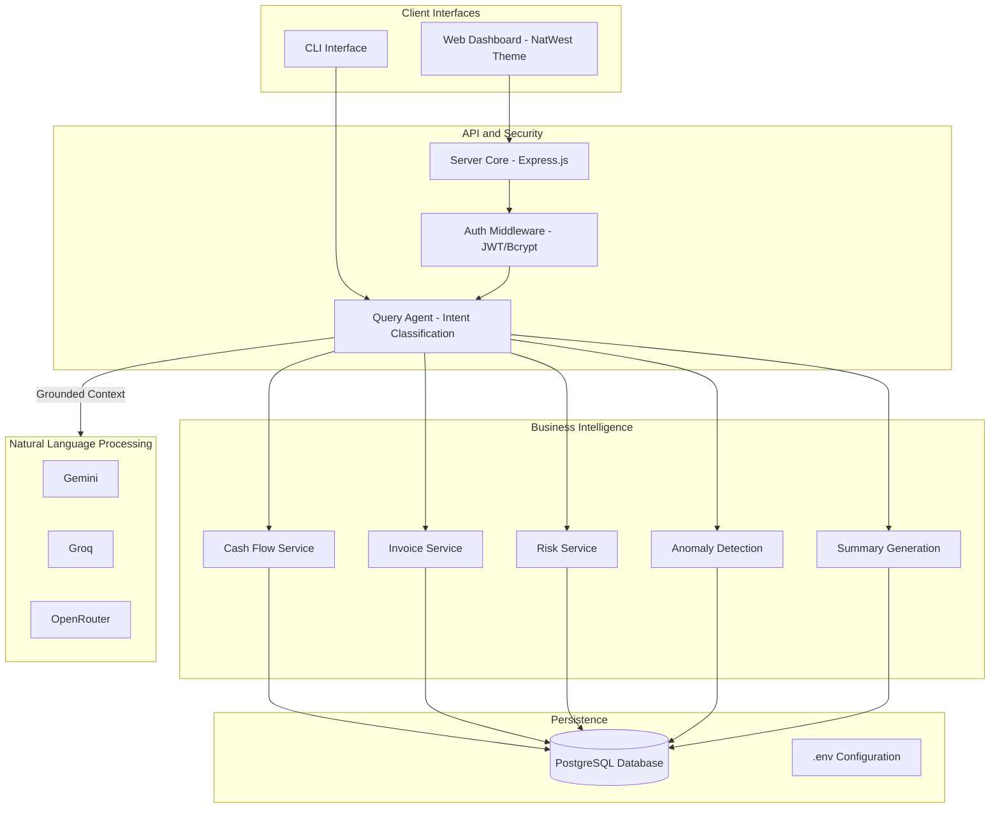

# System Architecture: CashGuardian

CashGuardian is engineered as a robust financial intelligence system that prioritizes data integrity and security. It utilizes a layered approach to separate user interactions, business logic, and persistent storage, ensuring that the platform remains reliable and scalable.

## System Overview

The application is structured into four primary layers: the Interface Layer, the Orchestration Layer, the Service Layer, and the Data Layer.

## Component Details

### Interface Layer

The platform offers two primary entry points:
- **Web Dashboard**: A modern, responsive interface styled with NatWest brand aesthetics. It provides real-time visualization of cash flows, overdue invoices, and business health metrics.
- **CLI Interface**: A terminal-based interaction tool for users who prefer a command-line environment for data querying and reporting.

### Orchestration Layer

This layer manages the flow of information and enforces security protocols:
- **Server Core**: Built on Express.js, it handles HTTP routing, request validation, and the orchestration of complex AI tasks.
- **Authentication Middleware**: Ensures that only authorized users can access the system. It uses JSON Web Tokens (JWT) for session management and Bcrypt for secure password hashing.
- **Query Agent**: Acting as the system's "brain," it classifies user intent and prepares a grounded context by gathering relevant data from the service layer before interacting with the LLM.

### Service Layer

A collection of deterministic logic modules that process transactional data:
- **Cash Flow Service**: Calculates net balances and performs period-over-period variance analysis.
- **Invoice Service**: Tracks payment statuses and identifies aging invoices.
- **Risk Service**: Evaluates client reliability based on historical payment patterns.
- **Anomaly Detection**: Identifies statistically significant spikes or drops in income and expenses.
- **Summary Generation**: Produces high-level narratives for weekly and monthly performance reviews.

### Data Layer

The persistence engine of the application:
- **PostgreSQL Database**: Provides a secure and organized storage solution for transactions, invoices, and user profiles. It enables complex relational queries and ensures data durability.
- **Configuration Management**: Uses environment variables to securely store sensitive credentials such as database URLs and API keys.

## The Grounding Process

To ensure accuracy, CashGuardian uses a "Grounding First" methodology. When a user asks a question, the system first retrieves the raw numbers from the database using deterministic code. These numbers are then injected into a strict system prompt along with the user's query. This ensures that the AI only interprets and narrates the data rather than attempting to calculate it, virtually eliminating mathematical hallucinations.
