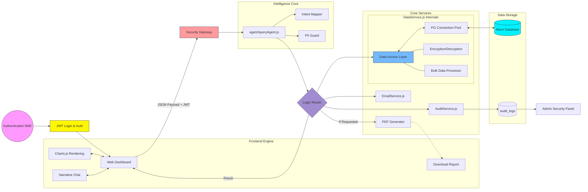

# 🛡️ CashGuardian: Technical Architecture
This document outlines the end-to-end architecture of CashGuardian for SMEs.
## 🏗️ System Architecture Flow (Compact Enterprise View)

---
## 📘 Detailed Process Explanation
### 1. Identity & Access
Every session begins with **JWT Authentication**, ensuring strict data silos where User A can never access User B's records.
### 2. Security Gateway
The gateway extracts `userId` and monitors for malicious patterns, logging threats directly to the **Audit Log**.
### 3. Intelligence Core
The **Agent** identify intent and fetch real-time data from PostgreSQL, eliminating hallucinations by using live numbers.
### 4. 🗄️ Inside DataService.js (The Data Backbone)
This module acts as the Single Source of Truth for all database interactions.
- **Connection Pooling**: Manages high-performance connections to Neon PostgreSQL.
- **CRUD Operations**: Specialized functions like `getTransactions(userId)`, `getInvoices(userId)`, and `getClients(userId)` ensure data is always scoped to the logged-in user.
- **Security Logic**: Integrates with `decrypt()` utility to securely handle encrypted PII (Aadhar, PAN) before passing it to the PII Guard for masking.
- **Batch Processing**: Powers the fast dataset upload feature using optimized bulk insert logic.
### 5. Multi-Channel Output
The system returns a rich JSON payload rendered as **Narrative Text**, **Interactive Charts**, and **PDF Documents**.
---
## 🚀 Why this architecture WOWS?
- **Horizontal Scalability**: Decoupled and modular services.
- **Privacy by Design**: Isolation at DB level and masking at API level.
- **Traceability**: Every AI decision is backed by an audit trail.
